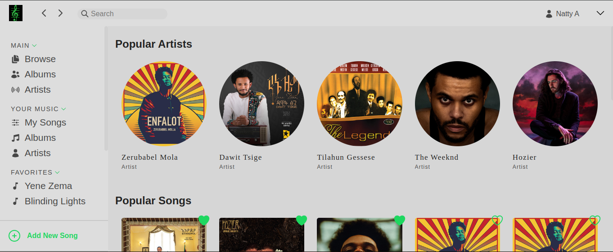
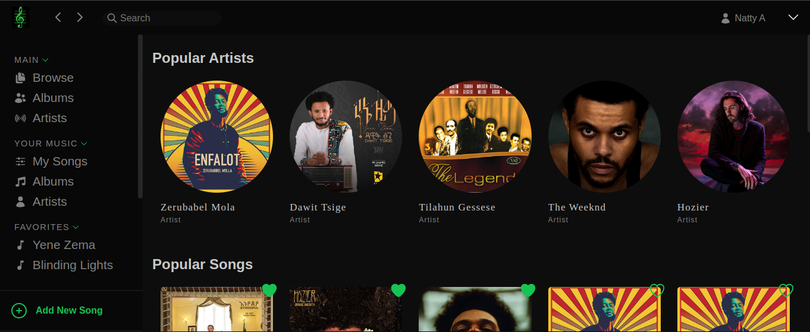
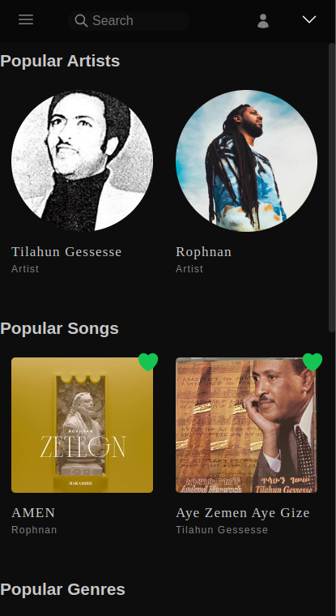
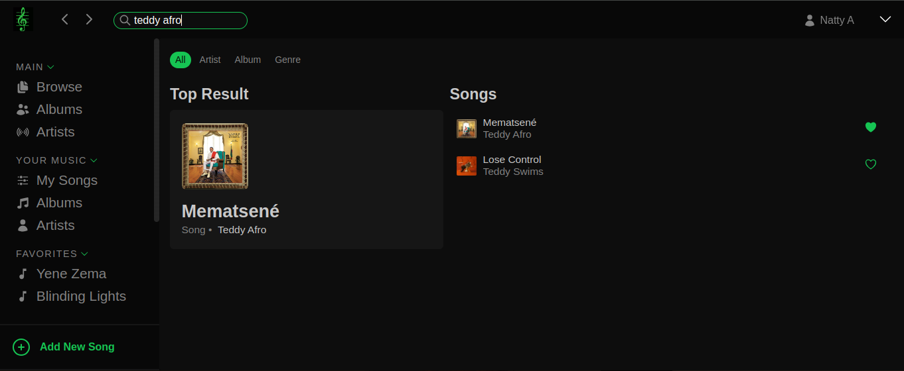
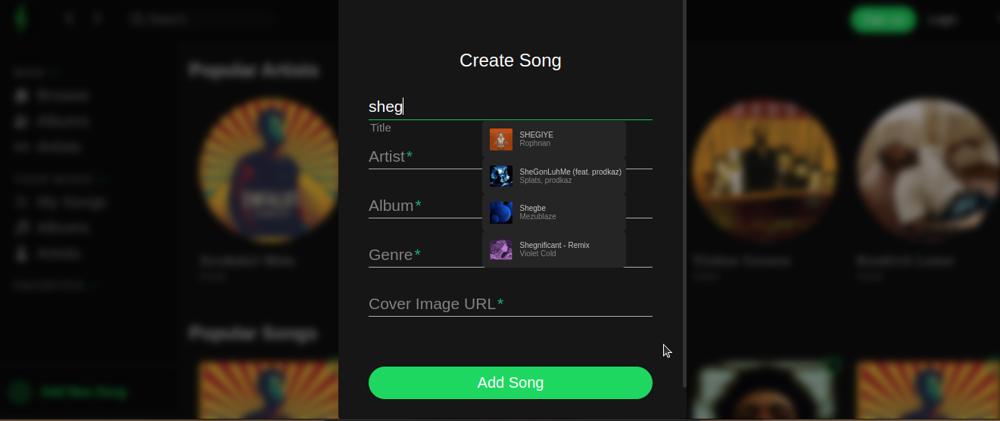
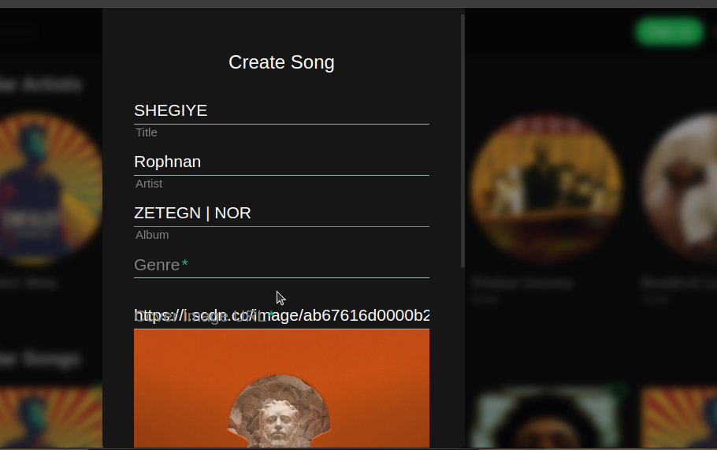

# Music Catalog & Search App








## Live Demo

Check out the live application here: [Live App](https://music-addis.vercel.app/)

---

## Application Features

- **CRUD Operations**: Create, read, update, and delete songs.
- **Search & Filters**: Search songs with filters by artist, album, and genre.
- **Spotify Integration**: Autocomplete song information using Spotify API during song creation.
- **User Authentication**: Users can sign up, log in, and manage their own songs and favorites.
- **Favorite Songs**: Save favorite songs to a personal list.
- **Responsive Design**: Optimized for mobile, tablet, and desktop, with a collapsible sidebar for smaller screens.
- **Light/Dark Mode**: Switch between light and dark themes.

---

## Tech Stack

**Frontend**:

- React
- Redux Toolkit, Redux-Saga
- TypeScript
- Emotion (for styling)
- Theme UI (for theming)

**Backend**:

- Node.js
- Express.js
- MongoDB

**Deployment**:

- Backend: Dockerized and deployed on Render
- Frontend: Deployed on Vercel

---

## Quick Setup

### Backend (Node.js + Express + MongoDB)

1. **Navigate to the Backend Folder**:

   ```bash
    cd backend

   ```

2. **Build Docker Image and Run:**

- Make sure you have Docker installed, then build and run the backend.

```bash
docker-compose up --build
```

- Environment Variables: Make sure to set up your .env file with all required environment variables like MongoDB URI, Spotify API credentials, etc.

```bash
MONGO_URI=your_mongo_uri
JWT_SECRET=your_jwt_secret
SPOTIFY_CLIENT_ID=your_spotify_client_id
SPOTIFY_CLIENT_SECRET=your_spotify_client_secret
```

### Frontend (React + Vite)

1. **Navigate to the Frontend Folder**

```bash
cd frontend
```

2. **Install Dependencies: Use the following command depending on your package manager**

```bash
npm install
# or
yarn install
# or
bun install
```

3. **Run the Frontend: Start the development server using**

```bash
npm run dev
```
